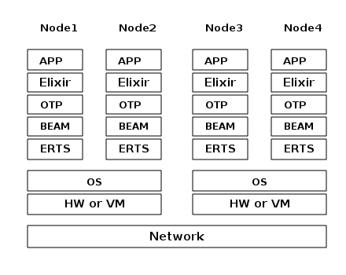
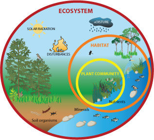

footer: Elixir 台灣
slidenumbers: true

# 進入 OTP 的世界

---
[.build-lists: true]

## 聽說一個語言叫 Elixir 處理 Concurrency 很厲害...

### 然後好像蓋在 OTP 上面什麼的...

---

我們是 Elixir Taiwan
我是 Mickey

---

## 所以什麼是 OTP 呢？

---

### 你的 Elixir 服務大概是這樣

---

### 上次介紹過 Process

--- 

### ...和怎麼在真實世界中使用 Process

[.column]
- 保持 Process 活著
- 保證溝通對象
- 處理對方 exception
- 處理 memory leak
- 處理 No Response
- 處理 Deadlock

[.column]
- ...etc.

^ 有沒有跟分散式系統很像？

--- 

## OTP 目標就是解決這些問題

--- 
[.build-lists: true]

### OTP = 

> ~~Outlaw Techno Pycho*****~~
> Open Telecom Platform
-- 不過現在沒人在意這叫什麼了啦

--- 

### 處理分散式架構很複雜
## OTP 幫你把大部分會用到的模式封裝成好用的模組

---

## OTP 常會用到的元件

- GenServer (gen_server)
- Supervisor
- Application

^ 其他的還有 gen_statem, gen_event, gen_tcp, gen_udp, gen_sctp

--- 

# GenServer

--- 

## GenServer 的 callbacks

[.column]
常用
- init
- handle_call
- handle_cast
- handle_info

[.column]
不常用
- code_change
- handle_continue (erl 21+)
- terminate

--- 

### Live Coding 囉~

---

# Supervisor

--- 

- 管理 GenServer 的生命 週期
- 重啟策略
  - one_for_one
  - one_for_all 
  - rest_for_one

--- 

### 更多 Live Coding 👨‍💻

--- 

## Application

---

- 特化的 Supervisor
- 獨立的環境和生命週期
- 擁有自己的設定

--- 

# Task, Agent, Broadway

---

## Task, Agent

- 把 GenServer 的兩個特性 (action, state) 分別處理
- Task 處理 action
- Agent 存 state

---

## Broadway

- 不在 Elixir 的函式庫裡
- Data Pipeline 上很好用

---
[.autoscale: true]
### ...官方功能

[.column]
- Back-pressure
- Automatic acknowledgements at the end of the pipeline
- Batching
- Fault tolerance with minimal data loss
- Graceful shutdown

[.column]
- Built-in testing
- Custom failure handling
- Ordering and partitioning
- Rate-limiting
- Metrics
- Back-off (TODO)

---

# 謝謝大家 🙏

